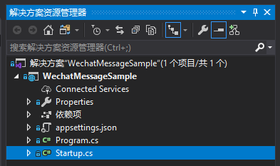
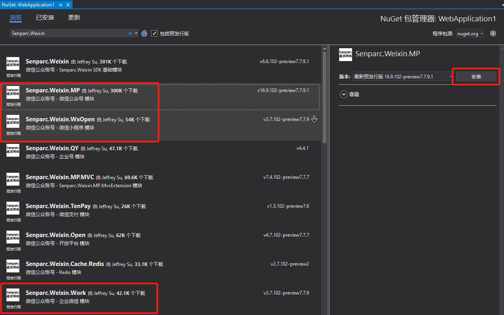
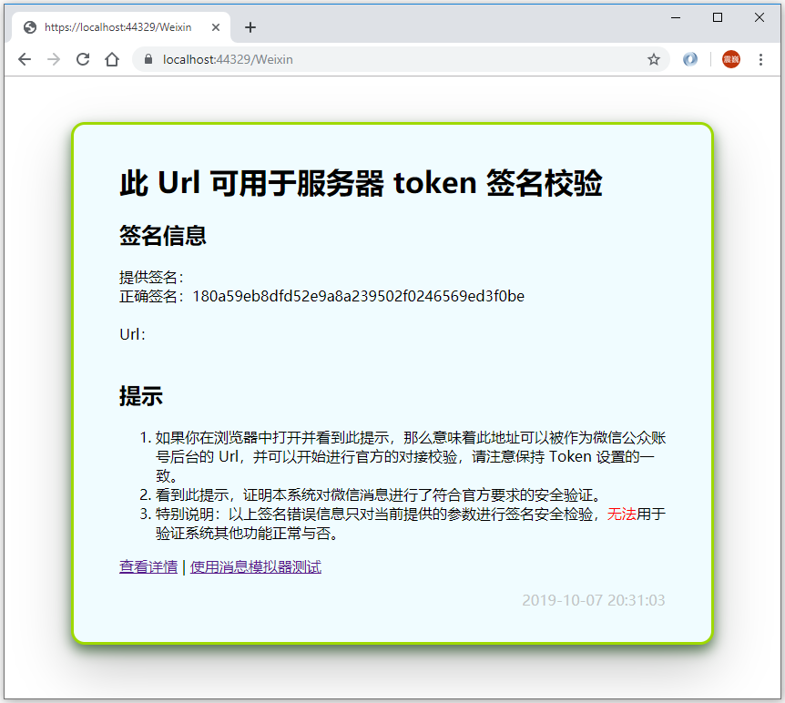
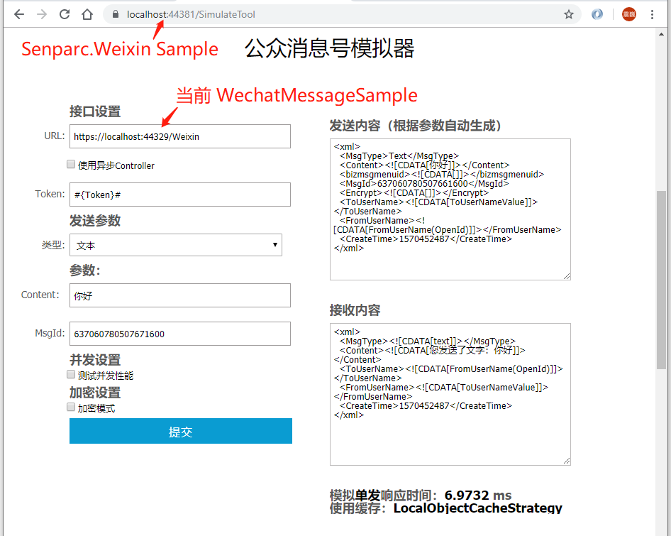
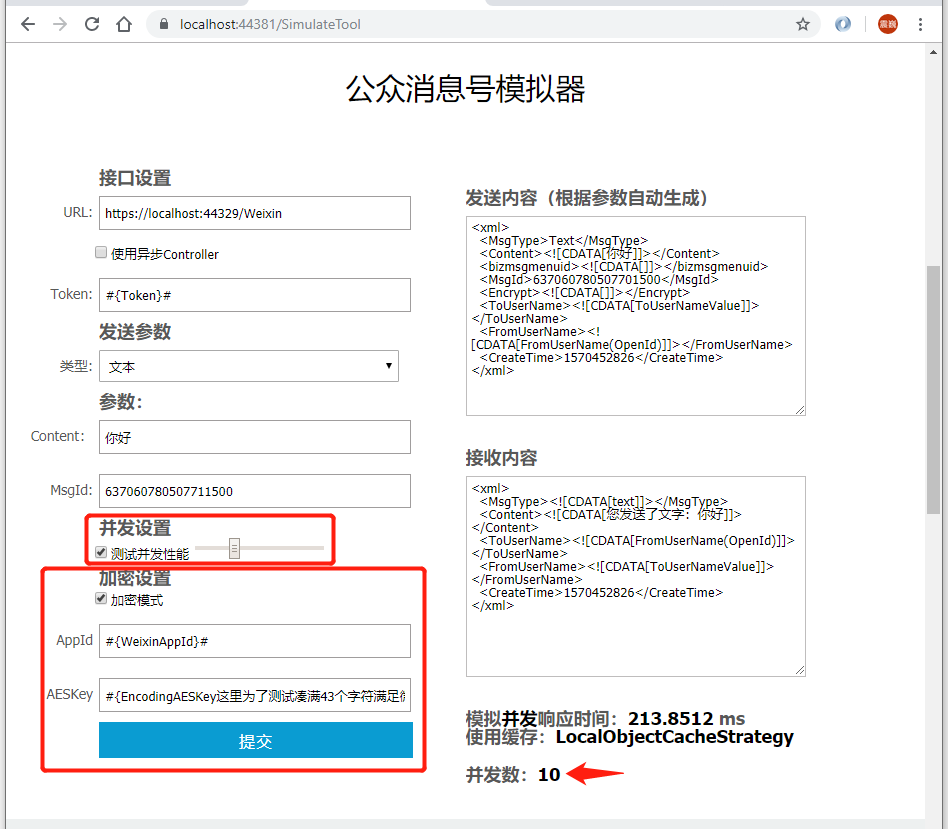
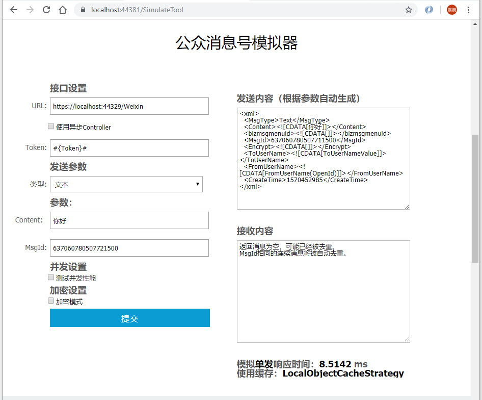

# Senparc.Weixin SDK 简易版 Sample ：WechatMessageSample

本实例展示了使用 [Senparc.Weixin SDK](https://github.com/JeffreySu/WeiXinMPSDK) 的初始化方式及 MessageHandler 消息中间件的用法（以公众号为例），本示例可直接用于部署，并进行微信公众号消息对接。

更多完整示例请看 [完整 Sample](https://github.com/JeffreySu/WeiXinMPSDK/blob/master/Samples/netcore3.0-mvc/Senparc.Weixin.Sample.NetCore3)

## 开发步骤

### 第一步：创建一个 .NET Core 3.0 Web 项目（空）：



原始的 [startup.cs](https://github.com/OpenSenparc/WechatMessageSample/blob/96f3e3781f8e77141f608bfca168ead383565229/WechatMessageSample/WechatMessageSample/startup.cs) 如下：

``` C#
namespace WechatMessageSample
{
    public class Startup
    {
        // This method gets called by the runtime. Use this method to add services to the container.
        // For more information on how to configure your application, visit https://go.microsoft.com/fwlink/?LinkID=398940
        public void ConfigureServices(IServiceCollection services)
        {
        }

        // This method gets called by the runtime. Use this method to configure the HTTP request pipeline.
        public void Configure(IApplicationBuilder app, IWebHostEnvironment env)
        {
            if (env.IsDevelopment())
            {
                app.UseDeveloperExceptionPage();
            }

            app.UseRouting();

            app.UseEndpoints(endpoints =>
            {
                endpoints.MapGet("/", async context =>
                {
                    await context.Response.WriteAsync("Hello World!");
                });
            });
        }
    }
}
```

### 第二步：使用 Nuget 添加 Senparc.Weixin SDK：



上图标注出来的 3 个包分别是：公众号、小程序和企业微信，本实例主要演示公众号，其他两个平台使用方法是一致的，可以举一反三，不再赘述。


### 第三步：创建自定义消息处理器（MessageHandler）：

``` C#
/// <summary>
/// 自定义公众号消息处理
/// </summary>
public class CustomMpMessageHandler : Senparc.Weixin.MP.MessageHandlers.MessageHandler<DefaultMpMessageContext>
{
    public CustomMpMessageHandler(Stream inputStream, PostModel postModel, int maxRecordCount = 0, bool onlyAllowEcryptMessage = false, DeveloperInfo developerInfo = null)
        : base(inputStream, postModel, maxRecordCount, onlyAllowEcryptMessage, developerInfo)
    {
    }

    public override IResponseMessageBase DefaultResponseMessage(IRequestMessageBase requestMessage)
    {
        throw new NotImplementedException();
    }
}
```

一般情况下，此文件是独立的 .cs 文件，当前实例为了方便展示，一起写在了 [startup.cs](/WechatMessageSample/WechatMessageSample/Startup.cs#L88) 文件中。

以上是一个默认的空的 MessageHandler，还不能正常运行，我们为 DefaultResponseMessage 添加默认的返回消息：

``` C#
public override IResponseMessageBase DefaultResponseMessage(IRequestMessageBase requestMessage)
{
    var responseMessage = base.CreateResponseMessage<ResponseMessageNews>();
    responseMessage.Articles.Add(new Article()
    {
        Title = "欢迎使用 Senparc.Weixin SDK",
        Description = "这是一条默认消息",
        PicUrl = "https://sdk.weixin.senparc.com/images/v2/logo.png",
        Url = "https://weixin.senparc.com"
    });
    return responseMessage;
}
```

也可以再创建一系列响应规则，例如处理文本信息，并返回一条文本：

``` C#
public override async Task<IResponseMessageBase> OnTextRequestAsync(RequestMessageText requestMessage)
{
    var responseMessage = base.CreateResponseMessage<ResponseMessageText>();
    responseMessage.Content = $"您发送了文字：{requestMessage.Content}";
    return responseMessage;
}
```

以此类推，可以为每一种类型的消息创建处理过程。

为了方便接下去的中间件对接，再创建一个初始化当前自定义 MessageHandler 示例的委托：

``` C#
public static Func<Stream, PostModel, int, CustomMpMessageHandler> GenerateMessageHandler = (stream, postModel, maxRecordCount)
                => new CustomMpMessageHandler(stream, postModel, maxRecordCount, false);

```

上述 CustomMpMessageHandler 构造函数中的最后一个 bool 参数（onlyAllowEcryptMessage），提供了一种加强的安全策略，可以指定是否只允许处理加密消息，开启之后，试图使用明文进行消息推送（嗅探）的请求将被拒绝（前提是对方已经拿到了正确的 Token），并终止后续处理流程，确保程序安全。

### 第四步：修改 startup.cs 进行全局注册

#### 修改 ConfigureServices() 方法：
``` C#
public Startup(IConfiguration configuration)
{
    Configuration = configuration;
}

public IConfiguration Configuration { get; }

public void ConfigureServices(IServiceCollection services)
{
    services.AddMemoryCache();//使用本地缓存必须添加（按需）

    services.AddSenparcWeixinServices(Configuration);//Senparc.Weixin 注册
}
```

#### 修改 Configure() 方法参数：

``` C#
public void Configure(IApplicationBuilder app, IWebHostEnvironment env,
        IOptions<SenparcSetting> senparcSetting, IOptions<SenparcWeixinSetting> senparcWeixinSetting)
```

#### Configure() 方法内追加：
``` C#
app.UseSenparcGlobal(env, senparcSetting.Value, globalRegister => { })
   .UseSenparcWeixin(senparcWeixinSetting.Value, weixinRegister =>
   {
       weixinRegister.RegisterMpAccount(senparcWeixinSetting.Value, "【盛派网络小助手】公众号");
   });
```

至此注册工作已经全部完成。

#### 指定使用 MessageHandler 中间件：

``` C#
app.UseMessageHandlerForMp("/WeixinAsync", CustomMpMessageHandler.GenerateMessageHandler,
    o => o.AccountSettingFunc = c => senparcWeixinSetting.Value);
```

### 第五步：配置 appsetting.json

参考：[appsetting.json](/WechatMessageSample/WechatMessageSample/appsettings.json#L11)

找到公众号的相关设置，修改 Token、AppId 等参数。

### 完成。

## 使用

使用 Ctrl + F5 打开当前项目，可以看到默认输出的 Hello World 消息，打开上述设置的 `/Weixin` 地址：



此时我们已经可以开始将站点部署到外网，提供给公众进行服务，所有的去重、加解密、上下文等过程系统已经全部配备。

## 测试

Senparc.Weixin SDK 为了方便开发者测试公众号消息，已经提供了一套[模拟器](https://sdk.weixin.senparc.com/SimulateTool)，可以用于发送和接收公众号消息的测试。

注意：如果测试本地 localhost 的项目，需要在本地运行模拟器，上述模拟器也已经包含在开源 Sample 中，可以下载后在本地运行并使用：



同样也支持并发测试以及加密模式：



如果同时发送两条 MsgId 相同的消息，会被自动去重过滤：


